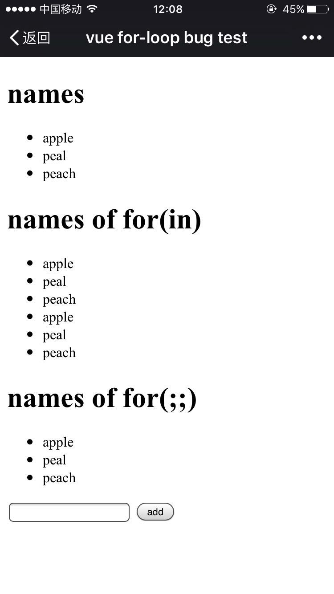

# vue-for-bug-demo

only in ios 9.3.

most ios of other version is correct。

the bug is:

let vm =  new Vue(params)

vm.$data.list is a array;

when you do this, it is right:

```javascript
for(var i = 0; i < vm.$data.list.length; i++) {}
```

but this is wrong. it run twice, and I don't know why

```javascript
for(var i in vm.$data.list) {}
```

this is a demo for the bug, and only in ios 9.3


you also can view it in http://vue.qizoubx.com/

the image

